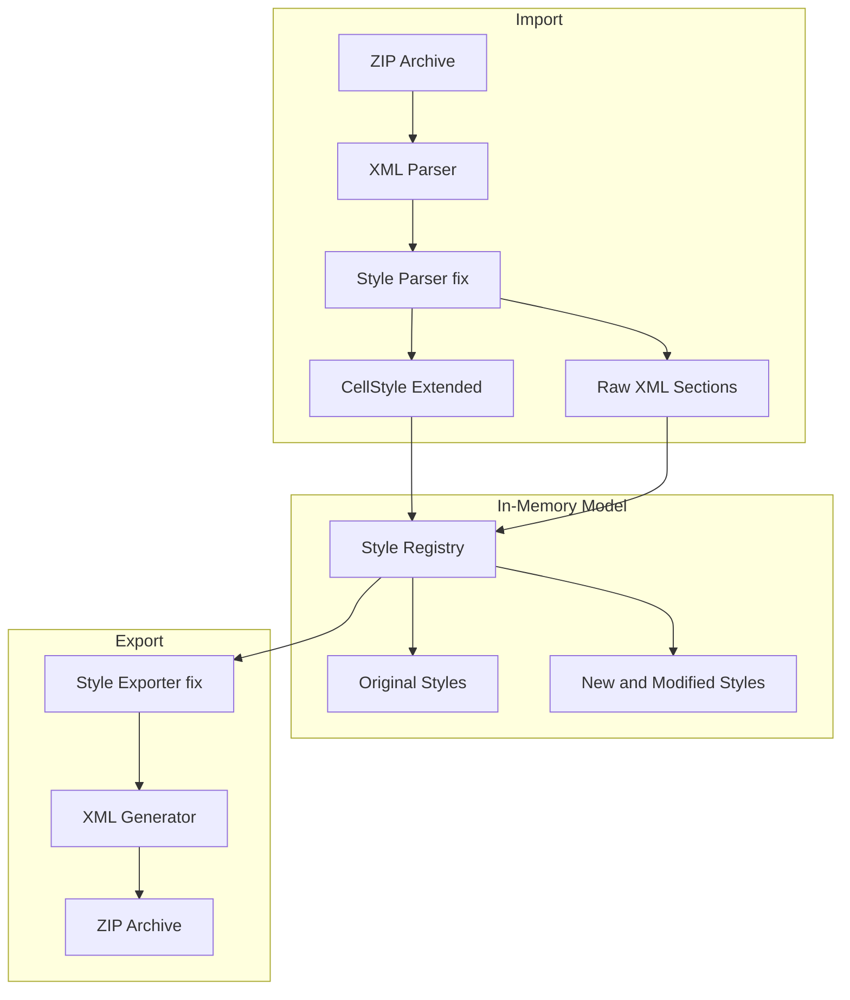
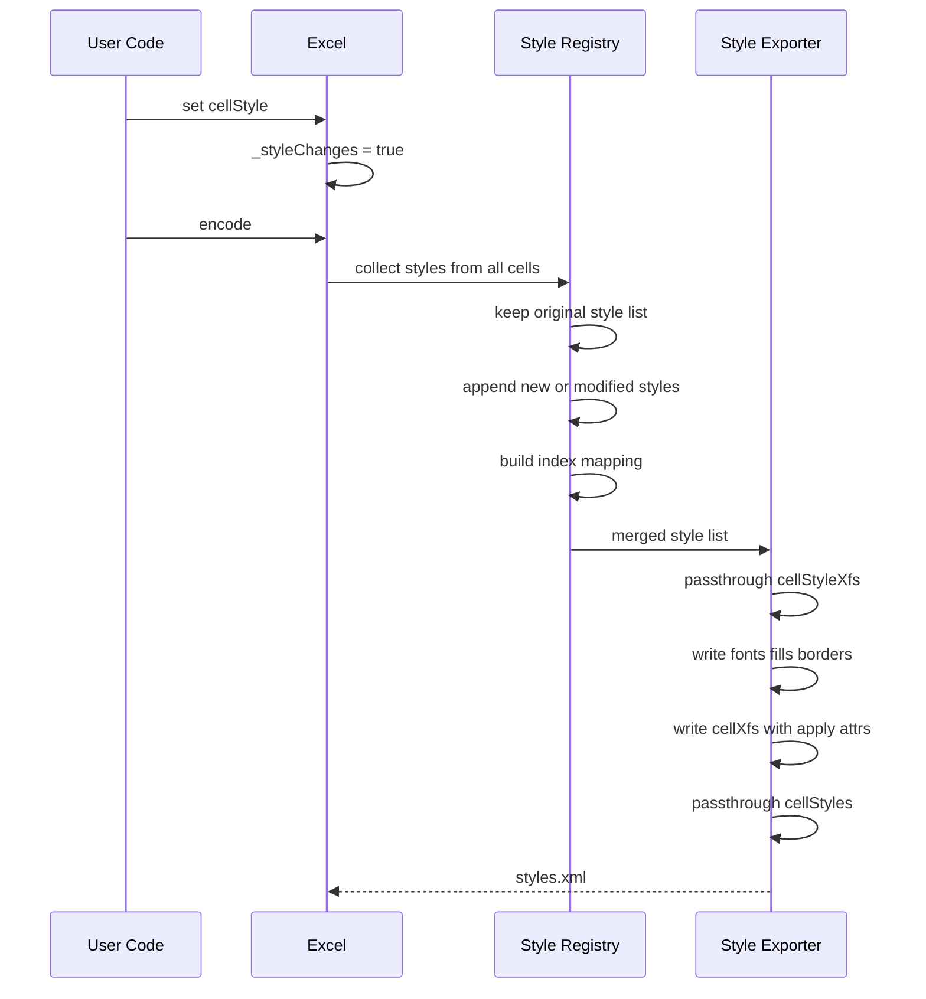
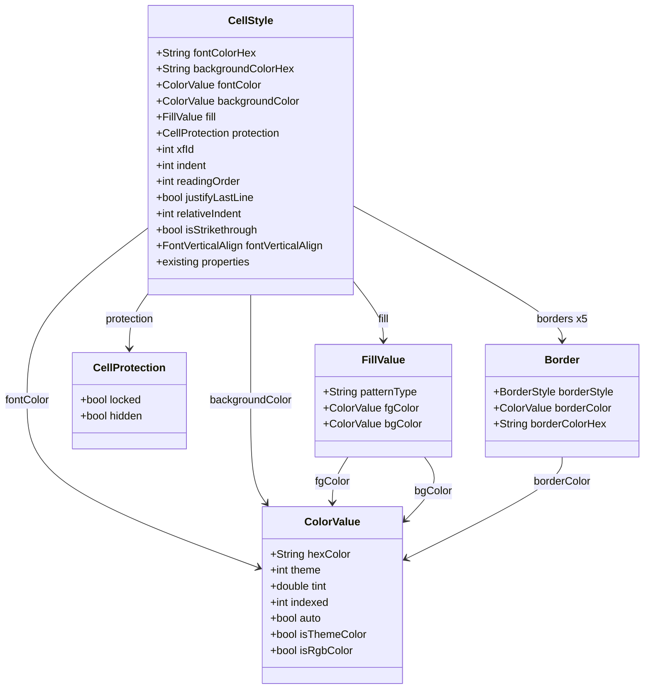

# 技術設計書: スタイル保持エクスポート

## Overview

**目的**: XLSXファイルのインポート→編集→エクスポート（ラウンドトリップ）において、セルスタイル情報（フォント、配置、罫線、塗りつぶし、数値書式、テーマカラー、セル保護等）の欠落を防止する。現行実装では `_styleChanges == true` 時にスタイル情報が不完全に再生成され、多くの属性が消失するが、本設計によりモデル拡張・パーサーバグ修正・エクスポーター改善を行い、元ファイルのスタイルを最大限保持する。

**利用者**: Excel ライブラリの利用者（Flutter/Dart 開発者）が、既存 XLSX ファイルを読み込み、編集後に再出力するワークフローで使用する。

**影響**: `CellStyle` モデルの拡張、`_parseStyles()` のバグ修正、`_processStylesFile()` の出力改善により、スタイル関連の内部処理が広範に変更される。既存の public API は後方互換を維持する。

### Goals
- `CellStyle` モデルを拡張し、OOXML スタイル属性（テーマカラー、パターン塗りつぶし、セル保護、アライメント拡張属性等）を網羅的にカバーする
- パーサーの既知バグ（アライメント属性読み取り元誤り、下線スタイル上書き）を修正する
- エクスポーターを改善し、`apply*` 属性・テーマカラー・パターン塗りつぶし・保護属性・`cellStyleXfs`/`cellStyles` を正しく出力する
- 既存 `CellStyle` API の後方互換性を維持する

### Non-Goals
- グラデーション塗りつぶし（`<gradientFill>`）のサポート
- 条件付き書式（`<dxf>`）のスタイル保持
- テーマ定義ファイル（`theme1.xml`）自体の編集機能
- `cellStyleXfs`/`cellStyles` セクションの編集 API
- テーマカラーから RGB への変換ロジック

## Architecture

> 詳細な調査ログは `research.md` を参照。本セクションではアーキテクチャ上の決定事項を記述する。

### Existing Architecture Analysis

現行アーキテクチャは 2 フェーズ処理モデル（Import/Export）を採用:
- **Import**: ZIP Archive → XML Parse → In-Memory Objects（`_cellStyleList`, `_fontStyleList`, `_patternFill`, `_borderSetList`）
- **Export**: Modified Objects → XML Generate → ZIP Archive

変更追跡フラグ `_styleChanges` により、スタイル変更がない場合は `xl/styles.xml` をそのまま透過する。

**現行の課題:**
1. `CellStyle` モデルが OOXML スタイル属性を部分的にしかカバーしていない（テーマカラー、indent、protection 等が未定義）
2. パーサーにバグあり（`<alignment>` の属性を `<xf>` から読み取っている）
3. 下線パースで `Double` が `Single` に上書きされる
4. エクスポーターが `applyBorder`、`applyNumberFormat` を未出力、`applyFont` の判定ロジックにバグ
5. テーマカラー参照が RGB に変換され、元の参照情報が失われる
6. `cellStyleXfs`/`cellStyles` セクションが `_styleChanges == true` 時に消失する
7. `_FontStyle` の Equatable に `_fontScheme` が含まれていない

### Architecture Pattern & Boundary Map



**Architecture Integration**:
- 選択パターン: 既存 2 フェーズ処理の拡張（ハイブリッドアプローチ）— 主要属性はモデル化、未操作セクションは Raw XML 透過
- ドメイン境界: Parser / Model / Save の3層責務分離を維持
- 既存パターン保持: `part of excel;` モノリシックライブラリ構造、`Equatable` ベースの値オブジェクト
- 新規コンポーネント: `ColorValue`（テーマカラー表現）、`FillValue`（塗りつぶし完全表現）、`CellProtection`（保護属性）
- ステアリング準拠: Pure Dart、最小外部依存、型安全

### Technology Stack

| レイヤー | 選択 / バージョン | 機能内での役割 | 備考 |
|---------|------------------|---------------|------|
| 言語 | Dart 3.6.0+ | モデル拡張・パーサー修正・エクスポーター改善 | 既存と同一 |
| XML 処理 | xml >=5.0.0 <7.0.0 | スタイル XML のパース・生成 | 既存依存 |
| 等値比較 | equatable ^2.0.0 | 拡張 CellStyle・新規値オブジェクトの重複排除 | 既存依存 |

新規外部依存なし。既存のスタック構成を変更しない。

## System Flows

### スタイル変更ありエクスポートフロー



**Key Decisions**:
- 元スタイルリストを全件保持し、新規/変更スタイルを末尾に追加する差分方式を採用
- 未変更セルの `s` 属性（スタイルインデックス）は変更しない
- `cellStyleXfs` / `cellStyles` は Raw XML として透過出力

## Requirements Traceability

| 要件 | 概要 | コンポーネント | インターフェース | フロー |
|------|------|---------------|----------------|--------|
| 1.1 | horizontal 属性の正確なパース | StyleParser | CellStyle | Import |
| 1.2 | vertical 属性の正確なパース | StyleParser | CellStyle | Import |
| 1.3 | textRotation 属性の正確なパース | StyleParser | CellStyle | Import |
| 1.4 | indent 属性のパースと保持 | StyleParser, CellStyle | CellStyle | Import |
| 1.5 | readingOrder 属性のパースと保持 | StyleParser, CellStyle | CellStyle | Import |
| 2.1 | Double underline の正確なパース | StyleParser | CellStyle | Import |
| 2.2 | 取り消し線の保持 | StyleParser, CellStyle | CellStyle | Import |
| 2.3 | 上付き/下付きの保持 | StyleParser, CellStyle | CellStyle | Import |
| 2.4 | fontScheme の等値比較対象追加 | _FontStyle | Equatable | - |
| 3.1 | 全パターン塗りつぶしタイプの再出力 | FillValue, StyleExporter | CellStyle | Export |
| 3.2 | fgColor/bgColor の区別保持 | FillValue, StyleParser | CellStyle | Import/Export |
| 3.3 | テーマカラー参照の塗りつぶし保持 | ColorValue, FillValue | CellStyle | Import/Export |
| 4.1 | applyBorder 属性の出力 | StyleExporter | XML 出力 | Export |
| 4.2 | applyFont 属性の出力修正 | StyleExporter | XML 出力 | Export |
| 4.3 | applyNumberFormat 属性の出力 | StyleExporter | XML 出力 | Export |
| 5.1 | protection 子要素の保持 | CellProtection, StyleParser, StyleExporter | CellStyle | Import/Export |
| 5.2 | cellStyleXfs/cellStyles の透過保持 | StyleExporter, Excel | Raw XML | Export |
| 5.3 | xfId 属性の保持 | CellStyle, StyleParser, StyleExporter | CellStyle | Import/Export |
| 5.4 | alignment 全属性の保持 | CellStyle, StyleParser, StyleExporter | CellStyle | Import/Export |
| 6.1 | フォントテーマカラーの保持 | ColorValue, StyleParser, StyleExporter | CellStyle | Import/Export |
| 6.2 | 塗りつぶしテーマカラーの保持 | ColorValue, StyleParser, StyleExporter | CellStyle | Import/Export |
| 6.3 | 罫線テーマカラーの保持 | ColorValue, StyleParser, StyleExporter | CellStyle | Import/Export |
| 7.1 | スタイル変更なし時の styles.xml 同一出力 | StyleExporter | - | Export |
| 7.2 | 有効な OOXML 構造の出力 | StyleExporter | XML 出力 | Export |
| 7.3 | 未変更セルのスタイルインデックス保持 | StyleRegistry | Index Mapping | Export |
| 7.4 | 新規スタイルエントリの正しい追加 | StyleRegistry | Index Mapping | Export |
| 7.5 | スタイル矛盾の自動修正 | StyleRegistry | Validation | Export |
| 8.1 | 既存プロパティの getter/setter 動作維持 | CellStyle | Public API | - |
| 8.2 | 新規プロパティのデフォルト値設定 | CellStyle | Public API | - |
| 8.3 | 既存テストの全パス | 全コンポーネント | Test Suite | - |

## Components and Interfaces

| コンポーネント | ドメイン/レイヤー | 目的 | 要件カバレッジ | 主要依存 (P0/P1) | コントラクト |
|---------------|------------------|------|--------------|------------------|-------------|
| ColorValue | Model | RGB/テーマカラーの統一表現 | 6.1, 6.2, 6.3 | Equatable (P0) | State |
| FillValue | Model | パターン塗りつぶしの完全表現 | 3.1, 3.2, 3.3 | ColorValue (P0), Equatable (P0) | State |
| CellProtection | Model | セル保護属性の保持 | 5.1 | Equatable (P0) | State |
| CellStyle 拡張 | Model | スタイル属性の完全モデル | 1.4, 1.5, 2.2, 2.3, 5.1, 5.3, 5.4, 8.1, 8.2, 8.3 | ColorValue (P0), FillValue (P0), CellProtection (P1) | State |
| _FontStyle 修正 | Model | フォント等値比較の完全化 | 2.4 | Equatable (P0) | State |
| Border 拡張 | Model | 罫線テーマカラー対応 | 6.3 | ColorValue (P0) | State |
| StyleParser 修正 | Parser | スタイル XML の正確なパース | 1.1-1.5, 2.1-2.4, 3.2, 3.3, 5.1, 5.3, 6.1-6.3 | CellStyle (P0), xml (P0) | Service |
| StyleExporter 修正 | Save | スタイル XML の完全な出力 | 3.1, 4.1-4.3, 5.1-5.4, 6.1-6.3, 7.1-7.5 | CellStyle (P0), xml (P0) | Service |
| StyleRegistry | Core | スタイルインデックス管理 | 7.3, 7.4, 7.5 | CellStyle (P0) | Service |

### Model Layer

#### ColorValue

| フィールド | 詳細 |
|-----------|------|
| 目的 | 色を RGB hex またはテーマ参照（theme index + tint）として統一的に表現する不変の値オブジェクト |
| 要件 | 6.1, 6.2, 6.3 |

**責務と制約**
- RGB hex 値とテーマカラー参照の両方を表現可能
- テーマカラーから RGB への変換は行わない（参照の保持が目的）
- Equatable による等値比較をサポート

**依存**
- External: equatable — 値オブジェクトの等値比較 (P0)

**コントラクト**: State [x]

##### State Management

```dart
class ColorValue extends Equatable {
  /// "AARRGGBB" 形式の RGB 値（例: "FF000000"）
  final String? hexColor;

  /// テーマカラーインデックス（0-11）
  final int? theme;

  /// テーマカラーのティント調整値（-1.0 ~ 1.0）
  final double? tint;

  /// レガシーインデックスカラー（0-63）
  final int? indexed;

  /// 自動色フラグ
  final bool? auto;

  bool get isThemeColor => theme != null;
  bool get isRgbColor => hexColor != null && theme == null;

  const ColorValue({this.hexColor, this.theme, this.tint, this.indexed, this.auto});
  const ColorValue.rgb(String hex) : hexColor = hex, theme = null, tint = null, indexed = null, auto = null;
  const ColorValue.fromTheme(int themeIndex, {double? tint}) : theme = themeIndex, tint = tint, hexColor = null, indexed = null, auto = null;

  List<Object?> get props => [hexColor, theme, tint, indexed, auto];
}
```

- 前提条件: `hexColor` は "FF" プレフィックス付き 8 桁 16 進数
- 不変条件: インスタンスは不変（全フィールド `final`）

**実装ノート**
- ファイル: `lib/src/sheet/color_value.dart`（`part of excel;`）
- 既存 `fontColorHex` / `backgroundColorHex` との後方互換は CellStyle の getter/setter レイヤーで実現

#### FillValue

| フィールド | 詳細 |
|-----------|------|
| 目的 | OOXML パターン塗りつぶしの完全な表現（パターンタイプ + 前景色 + 背景色） |
| 要件 | 3.1, 3.2, 3.3 |

**責務と制約**
- OOXML の全パターンタイプ（none, solid, mediumGray, darkGray, lightGray, darkHorizontal, darkVertical, darkDown, darkUp, darkGrid, darkTrellis, lightHorizontal, lightVertical, lightDown, lightUp, lightGrid, lightTrellis, gray125, gray0625）を表現
- 前景色（fgColor）と背景色（bgColor）を個別に保持
- 色は `ColorValue` を使用しテーマカラー参照にも対応

**依存**
- Outbound: ColorValue — 色表現 (P0)
- External: equatable — 等値比較 (P0)

**コントラクト**: State [x]

##### State Management

```dart
class FillValue extends Equatable {
  /// OOXML パターンタイプ名（"solid", "gray125", "darkGrid" 等）
  final String patternType;

  /// パターン前景色
  final ColorValue? fgColor;

  /// パターン背景色
  final ColorValue? bgColor;

  const FillValue({
    required this.patternType,
    this.fgColor,
    this.bgColor,
  });

  List<Object?> get props => [patternType, fgColor, bgColor];
}
```

**実装ノート**
- ファイル: `lib/src/sheet/fill_value.dart`（`part of excel;`）
- 既存の `_patternFill`（`List<String>`）はエクスポーターで `FillValue` のリストに置き換え
- `backgroundColorHex` setter 使用時は `FillValue(patternType: "solid", fgColor: ColorValue.rgb(hex))` を内部生成

#### CellProtection

| フィールド | 詳細 |
|-----------|------|
| 目的 | セル保護属性（locked / hidden）の保持 |
| 要件 | 5.1 |

**コントラクト**: State [x]

##### State Management

```dart
class CellProtection extends Equatable {
  /// セルのロック状態（Excel デフォルトは true）
  final bool locked;

  /// セルの数式非表示状態
  final bool hidden;

  const CellProtection({
    this.locked = true,
    this.hidden = false,
  });

  List<Object?> get props => [locked, hidden];
}
```

**実装ノート**
- ファイル: `lib/src/sheet/cell_protection.dart`（`part of excel;`）
- デフォルト値は Excel の標準動作に準拠（locked=true, hidden=false）

#### CellStyle（拡張）

| フィールド | 詳細 |
|-----------|------|
| 目的 | 既存 CellStyle を拡張し、OOXML スタイル属性を網羅的にカバーする |
| 要件 | 1.4, 1.5, 2.2, 2.3, 5.1, 5.3, 5.4, 8.1, 8.2, 8.3 |

**責務と制約**
- 既存の public getter/setter の動作を一切変更しない（8.1）
- 新規プロパティにはデフォルト値を設定し、明示的指定なしで既存コードが動作する（8.2）
- Equatable の `props` に新規フィールドを追加

**依存**
- Inbound: StyleParser — パース結果の格納先 (P0)
- Inbound: StyleExporter — エクスポート元データ (P0)
- Outbound: ColorValue — テーマカラー表現 (P0)
- Outbound: FillValue — 塗りつぶし表現 (P0)
- Outbound: CellProtection — 保護属性 (P1)

**コントラクト**: State [x]

##### State Management — 新規追加プロパティ

```dart
// ── アライメント拡張 (1.4, 1.5, 5.4) ──
int _indent = 0;
int _readingOrder = 0;
bool _justifyLastLine = false;
int _relativeIndent = 0;

// ── フォント拡張 (2.2, 2.3) ──
bool _isStrikethrough = false;
FontVerticalAlign _fontVerticalAlign = FontVerticalAlign.none;

// ── テーマカラー (6.1, 6.2) ──
ColorValue? _fontColor;
ColorValue? _backgroundColor;

// ── 塗りつぶし拡張 (3.1, 3.2, 3.3) ──
FillValue? _fill;

// ── セル保護 (5.1) ──
CellProtection? _protection;

// ── スタイル参照 (5.3) ──
int _xfId = 0;
```

**後方互換性の維持方法**:
- `fontColorHex` getter: `_fontColor?.hexColor ?? 'FF000000'` を返す
- `fontColorHex` setter: `_fontColor = ColorValue.rgb(value)` で設定
- `backgroundColorHex` getter: `_fill?.fgColor?.hexColor ?? _backgroundColor?.hexColor ?? 'none'` を返す
- `backgroundColorHex` setter: `_fill = FillValue(patternType: "solid", fgColor: ColorValue.rgb(value))` で設定
- 新規プロパティはすべてデフォルト値を持ち、明示的設定なしで既存コードが動作

**実装ノート**
- ファイル: `lib/src/sheet/cell_style.dart`（既存ファイル修正）
- `FontVerticalAlign` enum: `none`, `superscript`, `subscript`（`lib/src/utilities/enum.dart` に追加）
- `props` に全新規フィールドを追加して Equatable の正確性を維持

#### _FontStyle（修正）

| フィールド | 詳細 |
|-----------|------|
| 目的 | Equatable の `props` に `_fontScheme` を追加し、テーマカラー・取り消し線・上付き/下付きに対応 |
| 要件 | 2.4 |

**修正内容**:
- `props` リストに `_fontScheme` を追加（現在欠落しておりフォント重複排除に影響）
- `_isStrikethrough` フィールドを追加
- `_fontVerticalAlign` フィールドを追加
- `_fontColor` を `ColorValue?` 型に変更（テーマカラー対応）
- `props` に全新規フィールドを追加

**実装ノート**
- ファイル: `lib/src/sheet/font_style.dart`（既存ファイル修正）
- 既存の `_fontColorHex` は `ColorValue` 経由の互換アクセサを提供

#### Border（拡張）

| フィールド | 詳細 |
|-----------|------|
| 目的 | 罫線カラーのテーマカラー参照対応 |
| 要件 | 6.3 |

**修正内容**:
- `borderColor` フィールドを `ColorValue?` 型で追加
- 既存の `borderColorHex` getter/setter は `ColorValue` の `hexColor` と連動
- `props` に `borderColor` を追加

**実装ノート**
- ファイル: `lib/src/sheet/border_style.dart`（既存ファイル修正）

### Parser Layer

#### StyleParser（修正）

| フィールド | 詳細 |
|-----------|------|
| 目的 | `parse.dart` の `_parseStyles()` を修正し、全スタイル属性を正確にパース |
| 要件 | 1.1-1.5, 2.1-2.4, 3.2, 3.3, 5.1, 5.3, 6.1-6.3 |

**責務と制約**
- 既存パース処理のバグを修正（アライメント、下線）
- 新規 CellStyle プロパティへのパース追加
- テーマカラー参照のパース追加
- `cellStyleXfs` / `cellStyles` セクションの Raw XML 保持

**依存**
- Outbound: CellStyle — パース結果の格納先 (P0)
- Outbound: ColorValue — テーマカラーのパース (P0)
- Outbound: FillValue — 塗りつぶしのパース (P0)
- External: xml パッケージ — XML パース (P0)

**コントラクト**: Service [x]

##### Service Interface

```dart
// _parseStyles() 内の修正・追加項目

// ── Bug Fix 1: アライメント属性の読み取り元修正 (1.1, 1.2, 1.3) ──
// 変更前: node.getAttribute('vertical')    // <xf> から読み取り → 常に null
// 変更後: child.getAttribute('vertical')   // <alignment> から読み取り → 正確な値
// 対象: horizontal, vertical, textRotation の3箇所

// ── Bug Fix 2: 下線パース順序の修正 (2.1) ──
// 変更前: val属性あり → Double、<u>あり → Single（Single が上書き）
// 変更後: val属性の値で分岐
//   <u/> (属性なし)          → Underline.Single
//   <u val="double"/>        → Underline.Double
//   <u val="..."> (その他)   → Underline.Single

// ── 新規パース: アライメント拡張属性 (1.4, 1.5, 5.4) ──
// child.getAttribute('indent')         → CellStyle._indent
// child.getAttribute('readingOrder')   → CellStyle._readingOrder
// child.getAttribute('justifyLastLine') → CellStyle._justifyLastLine
// child.getAttribute('relativeIndent')  → CellStyle._relativeIndent

// ── 新規パース: フォント拡張 (2.2, 2.3) ──
// font.findElements('strike')   → CellStyle._isStrikethrough = true
// font.findElements('vertAlign') → val属性 → CellStyle._fontVerticalAlign

// ── 新規パース: テーマカラー (6.1, 6.2, 6.3) ──
// <color theme="1" tint="-0.25"/>
//   → ColorValue.fromTheme(1, tint: -0.25)
// <color rgb="FF000000"/>
//   → ColorValue.rgb("FF000000")
// フォント色、塗りつぶし fgColor/bgColor、罫線色の全箇所で対応

// ── 新規パース: パターン塗りつぶし詳細 (3.2, 3.3) ──
// <fill><patternFill patternType="darkGrid">
//   <fgColor theme="4"/>
//   <bgColor rgb="FFFFFFFF"/>
// </patternFill></fill>
//   → FillValue(patternType: "darkGrid",
//               fgColor: ColorValue.fromTheme(4),
//               bgColor: ColorValue.rgb("FFFFFFFF"))

// ── 新規パース: セル保護 (5.1) ──
// <xf ...><protection locked="1" hidden="0"/></xf>
//   → CellStyle._protection = CellProtection(locked: true, hidden: false)

// ── 新規パース: xfId (5.3) ──
// <xf xfId="1" .../>
//   → CellStyle._xfId = 1

// ── Raw XML 保持: cellStyleXfs, cellStyles (5.2) ──
// stylesXml.findAllElements('cellStyleXfs') → Excel._rawCellStyleXfs
// stylesXml.findAllElements('cellStyles')   → Excel._rawCellStyles
```

**実装ノート**
- ファイル: `lib/src/parser/parse.dart`（既存ファイル修正）
- バグ修正は `node.getAttribute()` → `child.getAttribute()` の3箇所の変更のみ
- 下線パース: if/else 構造に変更し、val="double" のみ Double、それ以外は Single
- 色パース: `_parseColorValue(XmlElement colorElement)` ヘルパー関数を新設し共通化

### Save Layer

#### StyleExporter（修正）

| フィールド | 詳細 |
|-----------|------|
| 目的 | `save_file.dart` の `_processStylesFile()` を修正し、スタイル情報を完全に出力 |
| 要件 | 3.1, 4.1-4.3, 5.1-5.4, 6.1-6.3, 7.1-7.5 |

**責務と制約**
- 全 `apply*` 属性の正確な出力
- テーマカラー参照の出力（RGB に変換しない）
- パターン塗りつぶしの完全な出力（全パターンタイプ、fgColor/bgColor 個別）
- `protection` 要素の出力
- `cellStyleXfs` / `cellStyles` の Raw XML 再挿入
- 元のスタイルインデックスの保持

**依存**
- Inbound: StyleRegistry — 統合スタイルリスト (P0)
- Inbound: CellStyle — エクスポートデータソース (P0)
- External: xml パッケージ — XML 生成 (P0)

**コントラクト**: Service [x]

##### Service Interface

```dart
// _processStylesFile() の修正項目

// ── Fix 1: apply* 属性の正確な出力 (4.1, 4.2, 4.3) ──
// applyBorder="1"       — borderId > 0 の場合に出力
// applyFont="1"         — fontId > 0 の場合に出力（ロジックバグ修正）
// applyNumberFormat="1" — numFmtId > 0 の場合に出力
// applyFill="1"         — fillId > 0 の場合に出力
// applyAlignment="1"    — alignment 属性がデフォルト以外の場合に出力

// ── Fix 2: xfId の保持 (5.3) ──
// 変更前: XmlAttribute(XmlName('xfId'), '0')        // 全エントリで 0 にハードコード
// 変更後: XmlAttribute(XmlName('xfId'), cellStyle.xfId.toString())

// ── Fix 3: パターン塗りつぶし出力の改善 (3.1, 3.2, 3.3) ──
// FillValue の patternType を使用して <patternFill patternType="..."> を出力
// fgColor と bgColor を個別に出力
// テーマカラー参照は <fgColor theme="4" tint="0.5"/> として出力

// ── Fix 4: テーマカラー出力 (6.1, 6.2, 6.3) ──
// ColorValue.isThemeColor:
//   <color theme="N" tint="T"/>
// ColorValue.isRgbColor:
//   <color rgb="AARRGGBB"/>
// フォント色、塗りつぶし色、罫線色の全箇所で対応

// ── Fix 5: protection 出力 (5.1) ──
// CellStyle.protection != null の場合:
//   <protection locked="1" hidden="0"/>

// ── Fix 6: alignment 全属性出力 (5.4) ──
// 既存: horizontal, vertical, textRotation, wrapText, shrinkToFit
// 追加: indent, readingOrder, justifyLastLine, relativeIndent

// ── Fix 7: cellStyleXfs / cellStyles 透過出力 (5.2) ──
// Excel._rawCellStyleXfs が存在する場合、<cellXfs> の前に挿入
// Excel._rawCellStyles が存在する場合、<cellXfs> の後に挿入

// ── Fix 8: フォント出力の拡張 (2.2, 2.3, 6.1) ──
// 取り消し線: <strike/>
// 上付き/下付き: <vertAlign val="superscript|subscript"/>
// テーマカラー: <color theme="..." tint="..."/>

// ── 共通ヘルパー ──
// _writeColorElement(ColorValue color) → XmlElement
//   テーマ/RGB/インデックスに応じた <color> 要素を生成
```

**実装ノート**
- ファイル: `lib/src/save/save_file.dart`（既存ファイル修正）
- `applyFont` バグ修正: 「両リストに存在」条件を「`fontId > 0`」に変更
- 塗りつぶし出力: 既存の `String` ベースの処理を `FillValue` ベースに置き換え
- `cellStyleXfs` / `cellStyles` は `styles.xml` の XML ツリーに Raw ノードとして再挿入

### Core Layer

#### StyleRegistry（スタイルインデックス管理ロジック）

| フィールド | 詳細 |
|-----------|------|
| 目的 | 元スタイルリストの保持、新規スタイルの追加、インデックスマッピングの整合性管理 |
| 要件 | 7.3, 7.4, 7.5 |

**責務と制約**
- 元スタイルリスト（`_cellStyleList`）のインデックスを全件保持
- 新規/変更スタイルを末尾に追加し、一意性を保証
- セルの `s` 属性とスタイルリストのインデックスの正確なマッピング

**依存**
- Outbound: CellStyle — スタイルの等値比較 (P0)

**コントラクト**: Service [x]

##### Service Interface

```dart
// _processStylesFile() 内のスタイル収集ロジック改善

// スタイルインデックス解決ロジック:
// 1. 元スタイルリスト(_cellStyleList)と同一 → 元のインデックスを返す
// 2. 既存の新規スタイルリストと同一 → そのインデックスを返す
// 3. 新規スタイル → リスト末尾に追加してインデックスを返す

// フォント/塗りつぶし/罫線の重複排除:
// 全スタイル（元 + 新規）のフォント定義を統合リストに収集
// 同一フォント定義は一つの fontId にマッピング
// 同様に fillId、borderId も重複排除

// _createCell() のインデックス解決:
// 未変更セル: 元の s 属性値をそのまま使用
// 変更セル: 統合スタイルリスト内の位置を s 属性値として設定
```

**実装ノート**
- 独立クラスではなく、`_processStylesFile()` と `_createCell()` 内のロジック改善として実装
- 元スタイルリストの全エントリを保持することで、未参照セルのスタイルインデックスも有効なまま維持
- 矛盾検出（7.5）: 参照先が存在しないインデックスはデフォルトスタイル（0）にフォールバック

## Data Models

### Domain Model



**集約ルート**: `CellStyle` — セルに適用されるスタイルの完全な表現

**値オブジェクト**: `ColorValue`, `FillValue`, `CellProtection`, `Border` — すべて Equatable で不変

**不変条件**:
- `fontColorHex` と `fontColor` は常に同期（setter でどちらを変更しても他方に反映）
- `backgroundColorHex` と `fill` の `fgColor` は常に同期
- `borderColorHex` と `borderColor` は常に同期
- `xfId` は `cellStyleXfs` 内の有効なインデックスを参照

### Logical Data Model

**Excel クラスの新規フィールド**:

| フィールド | 型 | 目的 |
|-----------|-----|------|
| `_rawCellStyleXfs` | `XmlElement?` | Import 時の `cellStyleXfs` セクションの Raw XML 保持 |
| `_rawCellStyles` | `XmlElement?` | Import 時の `cellStyles` セクションの Raw XML 保持 |

**既存フィールドの型変更**:

| フィールド | 変更前 | 変更後 | 理由 |
|-----------|--------|--------|------|
| `_patternFill` | `List<String>` | `List<FillValue>` | パターン塗りつぶしの完全表現 |

## Error Handling

### Error Strategy

本機能はライブラリ内部のパース/エクスポート処理であり、例外をスローする場面は最小限。パースエラーはデフォルト値でフォールバックし、エクスポートエラーは自動修正する。

### Error Categories and Responses

**パースエラー（Import 時）**:
- 不正な XML 属性値（例: `textRotation="abc"`）→ デフォルト値で処理し、例外なしで続行（既存動作を維持）
- 未知のパターンタイプ → `patternType` 文字列をそのまま保持（列挙型に依存しない）
- テーマカラーインデックス範囲外 → そのまま保持（テーマ解決は行わないため）

**エクスポートエラー（Export 時）**:
- スタイルインデックスの矛盾（参照先不在）→ デフォルトスタイル（インデックス 0）にフォールバック（7.5）
- 重複フォント/塗りつぶし/罫線定義 → 重複排除して最初のインデックスを使用（7.5）

## Testing Strategy

### Unit Tests
- `ColorValue`: RGB/テーマ/インデックス生成、等値比較、`isThemeColor` / `isRgbColor` 判定
- `FillValue`: パターンタイプ・色の等値比較、fgColor/bgColor 個別保持
- `CellProtection`: デフォルト値（locked=true, hidden=false）、等値比較
- `CellStyle` 拡張: 新規プロパティのデフォルト値、`fontColorHex` / `backgroundColorHex` getter/setter 後方互換性、`props` の完全性
- `_FontStyle`: `fontScheme` 込み等値比較の正確性

### Integration Tests
- アライメント属性の正確なラウンドトリップ（パース → エクスポート → 再パース で horizontal/vertical/rotation が一致）
- テーマカラー参照のラウンドトリップ（theme + tint が RGB に変換されず保持）
- パターン塗りつぶしのラウンドトリップ（patternType + fgColor + bgColor が保持）
- 下線スタイル（Single/Double）の正確なパースとラウンドトリップ
- セル保護属性（locked/hidden）のラウンドトリップ
- `apply*` 属性（applyBorder, applyFont, applyNumberFormat）の出力確認

### E2E Tests
- 既存テストスイートの全パス確認（8.3）
- スタイル変更ありでのエクスポート → 再インポートで全スタイル属性の一致確認
- 複雑なスタイルを持つ実ファイル（`test/test_resources/` 内）のラウンドトリップ
- `_styleChanges == false` 時の `xl/styles.xml` 同一性確認（7.1）
- 新規セルにスタイルを適用した場合のインデックス整合性と MS Excel 互換性（7.2, 7.4）

## Supporting References

### 修正対象ファイル一覧

| ファイル | 変更種別 | 概要 |
|---------|---------|------|
| `lib/src/sheet/color_value.dart` | 新規 | ColorValue 値オブジェクト |
| `lib/src/sheet/fill_value.dart` | 新規 | FillValue 値オブジェクト |
| `lib/src/sheet/cell_protection.dart` | 新規 | CellProtection 値オブジェクト |
| `lib/src/sheet/cell_style.dart` | 修正 | 新規プロパティ追加、後方互換 getter/setter |
| `lib/src/sheet/font_style.dart` | 修正 | fontScheme props 追加、新規フィールド |
| `lib/src/sheet/border_style.dart` | 修正 | ColorValue 対応 |
| `lib/src/parser/parse.dart` | 修正 | バグ修正、新規パース処理 |
| `lib/src/save/save_file.dart` | 修正 | apply* 修正、テーマカラー・塗りつぶし出力 |
| `lib/src/excel.dart` | 修正 | Raw XML フィールド追加 |
| `lib/src/utilities/enum.dart` | 修正 | FontVerticalAlign enum 追加 |
| `lib/excel.dart` | 修正 | 新規 part ディレクティブ追加 |
